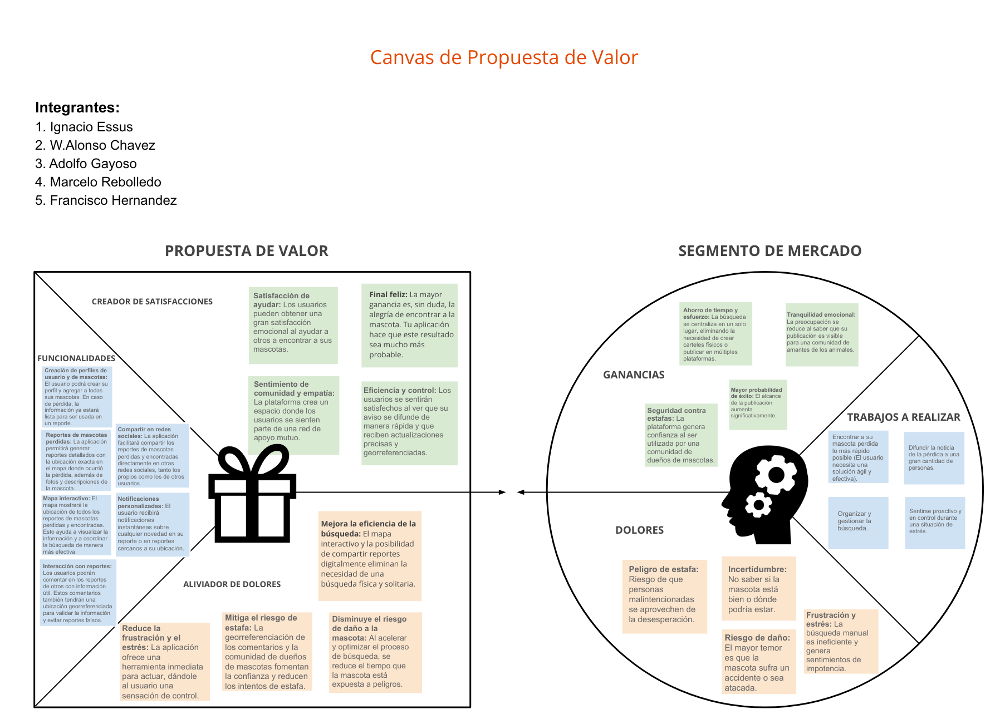

# PetConnect - UXD

User Experience Design for PetConnect: Post your lost pet instantly and browse pets for adoption in Temuco.

## Index

1. Introduction
2. Team & Roles
3. Strategy
4. Scope
5. Structure
6. Skeleton
7. Surface

## 1. Introduction
In Temuco, pet adoption and temporary fostering systems are highly fragmented. Most coordination currently takes place through disconnected social media platforms such as WhatsApp and Instagram, which makes the process unreliable and difficult to manage. Moreover, there is no official platform where people can consistently publish or search for pets in need. This app seeks to address both of these problems by providing a central, trustworthy hub for adoption and fostering.

## 2. Team & Roles
- Ignacio Essus
- W. Alonso Chavez
- Marcelo Rebolledo                                                              
- Fernando Hernandez
- Adolfo Gayoso

## 3. Strategy
The first step under the Elements of User Experience is the Strategy plane, which focuses on incorporating not only what the people running the application want to get out of it but what the users want to get out of the application.

From this aproach, a Value Proposition Canvas is used to determined what the people wants to earn from our solution and how are we gonna respond to those needs.

## 4. Scope
## 5. Structure
## 6. Skeleton
## 7. Surface
