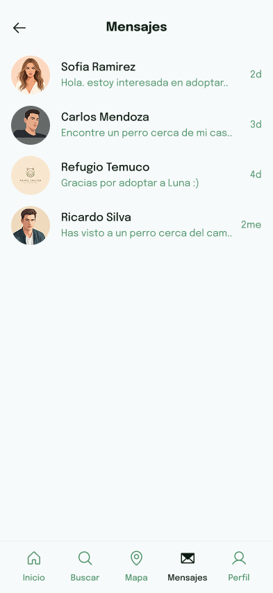

# PetConnect - UXD

User Experience Design for PetConnect: Post your lost pet instantly and browse pets for adoption in Temuco.

## Index

- [1. Introduction](#1-introduction)
- [2. Team](#2-Team)
- [3. Strategy](#3-strategy)
- [4. Solutions Scope](#4-solutions-scope)
- [5. Benchmark](#5-Benchmark)
- [6. Customer Journey Map](#6-customer-journey-map)
- [7. Navigation](#7-Navigation)
- [8. Mockups](#8-mockups)
- [9. HD Interfaces](#9-wireframes)

---

## 1. Introduction
In Temuco, pet adoption and temporary fostering systems are highly fragmented. Most coordination currently takes place through disconnected social media platforms such as WhatsApp and Instagram, which makes the process unreliable and difficult to manage. Moreover, there is no official platform where people can consistently publish or search for pets in need. This app seeks to address both of these problems by providing a central, trustworthy hub for adoption and fostering.

---

## 2. Team & Roles
- Ignacio Essus - Analyst
- W. Alonso Chavez - Designer
- Marcelo Rebolledo - Presenter                                                    
- Fernando Hernandez - Designer
- Adolfo Gayoso - Project Manager

---

## 3. Strategy
The first step under the Elements of User Experience is the Strategy plane, which focuses on incorporating not only what the people running the application want to get out of it but what the users want to get out of the application.

From this approach, a Value Proposition Canvas is used to determine what the people wants to earn from our solution and how are we gonna respond to those needs.

##### Value Canvas:

---

## 4. Solutions Scope

Defining the solution's scope is crucial to ensure the design remains focused on the problems identified in the strategy. PetConnect will primarily focus on two key functionalities: centralizing the posting and searching for lost pets and streamlining the process of pet adoption and temporary fostering within the commune of Temuco. This means the application must provide a robust profile system, simplified forms for publishing alerts and adoptions, and clear navigation that directs users to their desired action (whether it is Finding a pet or Posting about one). Development will be limited to these core functionalities to guarantee a reliable user experience before considering any future expansions.

##### Persona 1:

##### Persona 2:

##### Persona 3:

---

## 5. Benchmark

To develop a solution that truly meets user expectations and rises above the existing chaotic landscape in Temuco, an exhaustive competitive analysis, or benchmarking, is essential. This process involves thoroughly examining current apps and platforms (especially those focused on lost pets and adoption) to identify their crucial strengths and significant shortcomings. By learning from competitors' successful features, we can integrate proven functionalities into PetConnect while strategically avoiding their design or process flaws. This objective perspective will ensure our application is not only reliable but also offers a superior, market-aligned user experience that directly addresses the fragmented systems our users currently face.

##### Persona 3:

---

## 6. Customer Journey Map

The Customer Journey Map visually outlines the end-to-end experience of our core user personas when trying to achieve their main goals—either adopting a pet or reporting a lost one. This map is vital for identifying current pain points and moments of frustration within the existing fragmented system. By charting the user's emotional state, actions, and touchpoints, we can precisely pinpoint the opportunities where PetConnect can introduce seamless features to eliminate friction and provide a trustworthy, centralized solution.

##### Customer Journey Map:

---

## 7. Navigation

To ensure PetConnect is easy and reliable, the Navigation must be simple. This section details the app's structure and layout, focusing on making key actions (like reporting a pet or browsing for adoption) achievable in the fewest steps possible. Our goal is to create an intuitive information architecture that eliminates confusion, minimizes user effort, and builds quick trust.

##### Navigation:

---

## 8. Wireframes

The Wireframes section shows the basic structure and layout of the app. These simple, low-fidelity drawings focus only on where the content and functions will go, not on how they look. This step ensures the app's navigation and key user flows are efficient and clear before we add any visual design or color.

##### Wireframes:

---

## 9. Mockups

The Mockups section represents the final visual design of the PetConnect application. Building upon the approved wireframes and navigation structure, these high-fidelity screens incorporate the defined color palette, typography, and imagery. They demonstrate the aesthetic and user interface (UI) choices, providing a realistic preview of the final product and ensuring the visual design aligns with the goal of creating a trustworthy, simple, and engaging platform for the community.

---